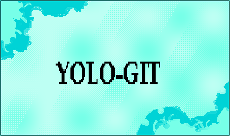

## Description

- Some off time project I made based on what I learned (remembered?) in Engineering Science.
- This is a simple proof-of-concept demonstrating basic rigid-body physics implementation using Matter.js and Vite. It tests environmental boundary limits, object restitution (bounciness), and DOM-to-Canvas event listening.
- _Note: The UI is currently a bit buggy and the 'system.ext' debug button occasionally causes memory leaks or UI glitches. I'll patch this in a future update. (DO NOT CLICK!)_

### Features

- Interactive Matter.js physics engine
- Drag-and-drop mouse controls
- Responsive collision boundaries
- Calming, seamless loop design

### Tech Stack

- HTML5 Canvas / Vanilla JS
- Vite Development Server
- Matter.js 2D Physics Engine

## 

# Security

- For security, please refer to the [SECURITY.md](SECURITY.md) file for more details.

# License

- This project is licensed under the [MIT License](LICENSE.md). Please refer to the [LICENSE.md](LICENSE.md) file for more details.

- _"042/17-ZV1"_
